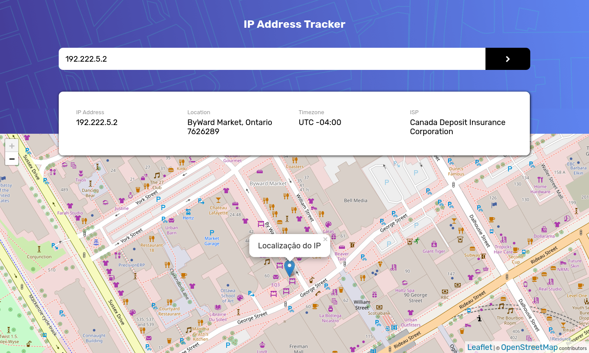

## Table of contents

- [Overview](#overview)
  - [The challenge](#the-challenge)
  - [Screenshot](#screenshot)
- [My process](#my-process)
  - [Built with](#built-with)
  - [Useful resources](#useful-resources)
- [Author](#author)

## Overview

### The challenge

Users should be able to:

- View the optimal layout for each page depending on their device's screen size
- See hover states for all interactive elements on the page
- See their own IP address on the map on the initial page load
- Search for any IP addresses or domains and see the key information and location

### Screenshot

## My process

### Built with

- Semantic HTML5 markup
- CSS custom properties
- Flexbox
- Mobile-first workflow
- Vanilla Javascript

### Useful resources

- [Leaflet Map API](https://leafletjs.com/)
- [IPFY Geolocation API](https://geo.ipify.org/) 

## Author

- GitHub - [GitHubPortifolio](https://github.com/Netosilv4/)
- Frontend Mentor - [@yourusername](https://www.frontendmentor.io/profile/netosilv4)
- Linkedin - [@Neto Silva](https://www.linkedin.com/in/netosilv4/)

